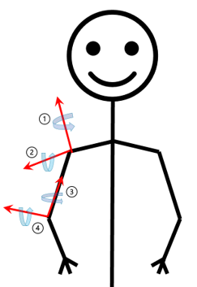
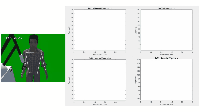

# Upperlimb-Localization
The project is developed in Windows 10 Operating System by Python 3.9

Refer to:

https://github.com/google/mediapipe  
https://github.com/pupil-labs/apriltags  
https://github.com/Razg93/Skeleton-Tracking-using-RealSense-depth-camera

The program will automatically install requisite package for you.

If not, please manually install Mediapipe and Apriltag:

`pip install mediapipe`

`pip install pupil_apriltags`  

## Degree of Freedom (DoF) Induction:  
  
DoF1 Plane of Elevation  
DoF2 Elevation  
DoF3 Internal/External  
DoF4 Extension/Flexion  

## Parameter Induction:

`python main.py 0` No visualization

`python main.py 1` DoF1 Plane of Elevation

`python main.py 2` DoF2 Elevation

`python main.py 3` DoF3 Internal/External

`python main.py 4` DoF4 Extension/Flexion

The program pre-assumed following operating environment, and has been evaluated   
under simulation environment:

##Coordinate System 
The camera coordinate system has the origin at the center of RGB imager. The y-axis points from the imager out the lens. The x-axis is to the right in the image taken by the camera, and z is upward. The Robotic coordinate frame is centered at the center of the tag, with x-axis into the tag, y-axis to the left, and z-axis upward.

